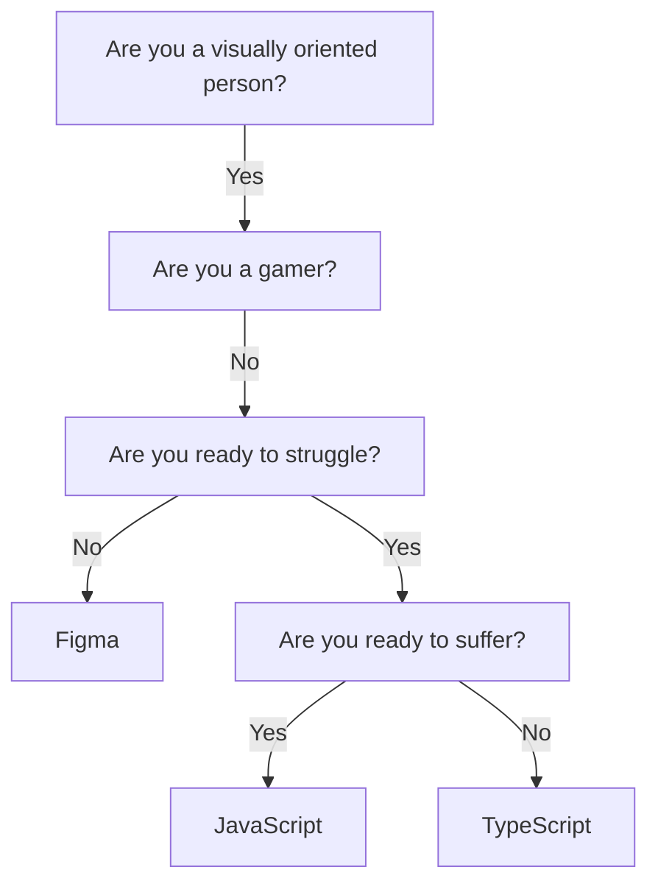

```mermaid
graph TD;
    Start[Are you a visually oriented person?] --> |Yes| Gamer[Are you a gamer?]
    Gamer --> |No| Non-gamer[Are you ready to struggle?]
    Non-gamer --> |No| No-struggle[Figma]
    Non-gamer --> |Yes| Struggle[Are you ready to suffer?]
    Struggle --> |Yes| JS[JavaScript]
    Struggle --> |No| TS[TypeScript]
```
