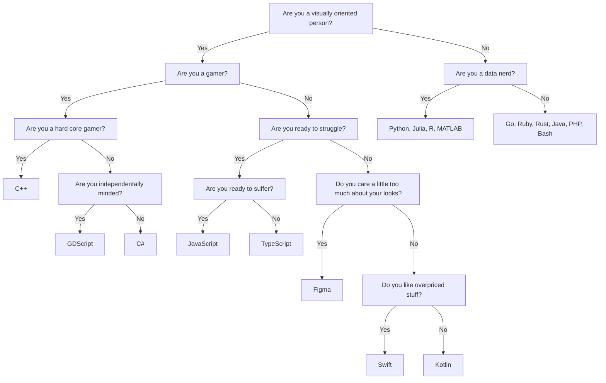

For [Python, Julia, R, MATLAB]

First question: Do you think you're the shit?

Yes -> Python or Julia

    For Python or Julia: Do you think you're extremely cool? Yes -> Julia. No -> Python.

No -> R or MATLAB

    For R or MATLAB: Do you think imagine yourself being in the movie Moneyball? Yes -> R. No -> MATLAB.

Non-visual --> |No| Non-data-nerd[Go, Ruby, Rust, Java, PHP, Bash]

First question: Do you want to make money? Yes -> [Java, PHP] No -> [Go, Ruby, Bash, Rust]
