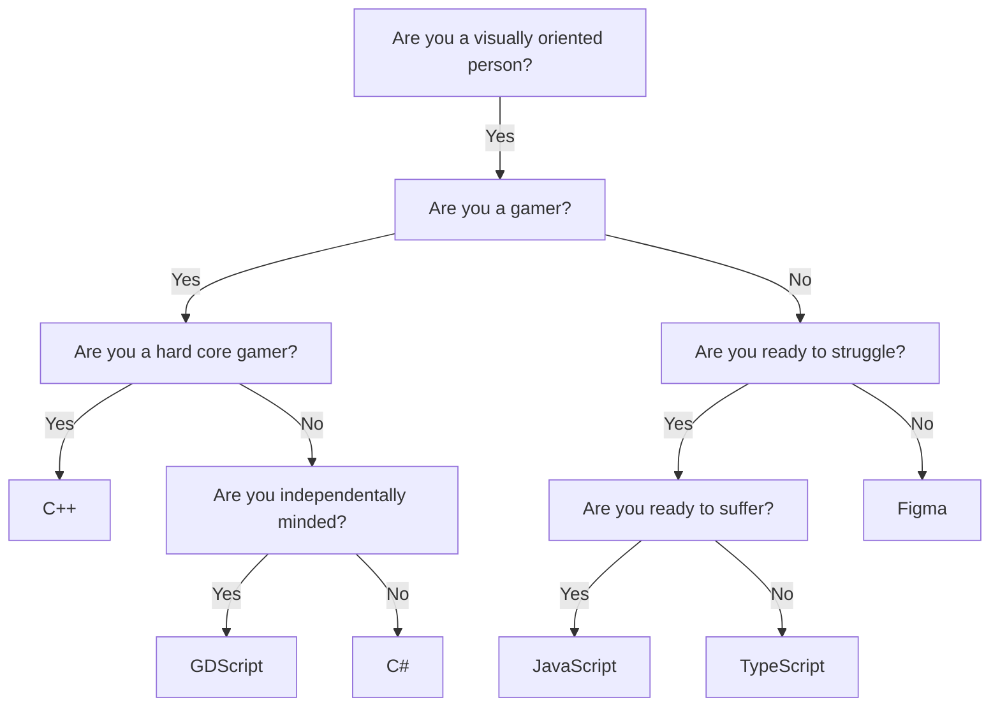

```mermaid
graph TD;
    Start[Are you a visually oriented person?] --> |Yes| Visual[Are you a gamer?]
        Visual --> |Yes| Gamer[Are you a hard core gamer?]
            Gamer --> |Yes| Hard-core-gamer[C++]
            Gamer --> |No| Soft-core-gamer[Are you independentally minded?]
                Soft-core-gamer --> |Yes| gd-script[GDScript]
                Soft-core-gamer --> |No| c-sharp[C#]
        Visual --> |No| Non-gamer[Are you ready to struggle?]
            Non-gamer --> |Yes| Struggle[Are you ready to suffer?]
            Non-gamer --> |No| No-struggle[Figma]
            Struggle --> |Yes| JS[JavaScript]
            Struggle --> |No| TS[TypeScript]
```
