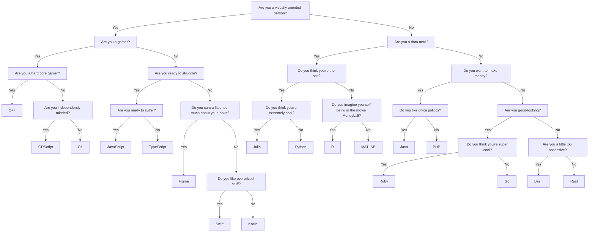

```mermaid
graph TD;
    Start[Are you a visually oriented person?] --> |Yes| Visual[Are you a gamer?]
        Visual --> |Yes| Gamer[Are you a hard core gamer?]
            Gamer --> |Yes| Hard-core-gamer[C++]
            Gamer --> |No| Soft-core-gamer[Are you independently minded?]
                Soft-core-gamer --> |Yes| gd-script[GDScript]
                Soft-core-gamer --> |No| c-sharp[C#]
        Visual --> |No| Non-gamer[Are you ready to struggle?]
            Non-gamer --> |Yes| Struggle[Are you ready to suffer?]
                Struggle --> |Yes| JS[JavaScript]
                Struggle --> |No| TS[TypeScript]
            Non-gamer --> |No| No-struggle[Do you care a little too much about your looks?]
                    No-struggle ---> |Yes| Figma[Figma]
                    No-struggle ---> |No| Mobile[Do you like overpriced stuff?]
                        Mobile ---> |Yes| Swift[Swift]
                        Mobile ---> |No| Kotlin[Kotlin]
    Start --> |No| Non-visual[Are you a data nerd?]
        Non-visual --> |Yes| Data-nerd[Do you think you're the shit?]
            Data-nerd --> |Yes| Python-Julia[Do you think you're extremely cool?]
                Python-Julia --> |Yes| Julia[Julia]
                Python-Julia --> |No| Python[Python]
            Data-nerd --> |No| R-MATLAB[Do you imagine yourself being in the movie Moneyball?]
                R-MATLAB --> |Yes| R[R]
                R-MATLAB --> |No| MATLAB[MATLAB]
        Non-visual --> |No| Non-data-nerd[Do you want to make money?]
            Non-data-nerd --> |Yes| Java-PHP[Do you like office politics?]
                Java-PHP --> |Yes| Java[Java]
                Java-PHP --> |No| PHP[PHP]
            Non-data-nerd --> |No| Go-Ruby-Bash-Rust[Are you good-looking?]
                Go-Ruby-Bash-Rust --> |Yes| Go-Ruby[Do you think you're super cool?]
                    Go-Ruby --> |Yes| Ruby[Ruby]
                    Go-Ruby --> |No| Go[Go]
                Go-Ruby-Bash-Rust --> |No| Bash-Rust[Are you a little too obsessive?]
                    Bash-Rust --> |Yes| Bash[Bash]
                    Bash-Rust --> |No| Rust[Rust]
```
