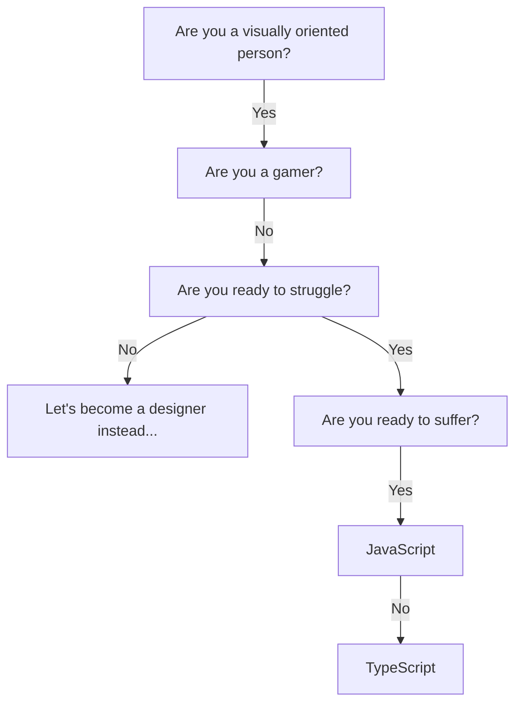

```mermaid
graph TD;
    A[Are you a visually oriented person?] --> |Yes| Gamer[Are you a gamer?]
    Gamer --> |No| B[Are you ready to struggle?]
    B --> |No| C[Let's become a designer instead...]
    B --> |Yes| D[Are you ready to suffer?]
    D --> |Yes| E[JavaScript]
    E --> |No| F[TypeScript]
```
